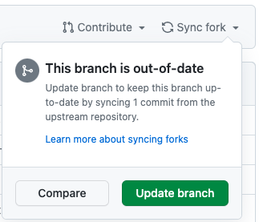

#  Fork Syncer

## What does it do?
For the logged-in GitHub user, syncs all forked repositories with the default branch of their upstream parent.

This is analogous to syncing the fork via the GitHub UI for all forked repositories:



## Usage

### Automated GitHub Action
Runs periodically.

1. [Fork this repo](https://github.com/JackPGreen/fork-syncer/fork)
2. [Create a new Personal Access Token (PAT)](https://github.com/settings/tokens/new) with the `workflow` scope
3. Add the PAT as a Repository Secret in the fork
    1. `Settings`
    2. `Security and variables`
    3. `Actions`
    4. `New repository secret`
        - Name = `PAT`
        - Secret = Your PAT
    5. `Add secret`
4. Enable workflow in forked repository
    1. `Actions`
    2. `I understand my workflow, go ahead and enable them`
5. Test workflow
    1. `Actions`
    2. `Scheduled Fork Syncer`
    3. `Run workflow`
    4. `Run workflow`
    5. Check output
        - For SAML authenticated repositories, additional one-time authorization will be required


### Locally:
```shell
./fork-syncer.sh
```